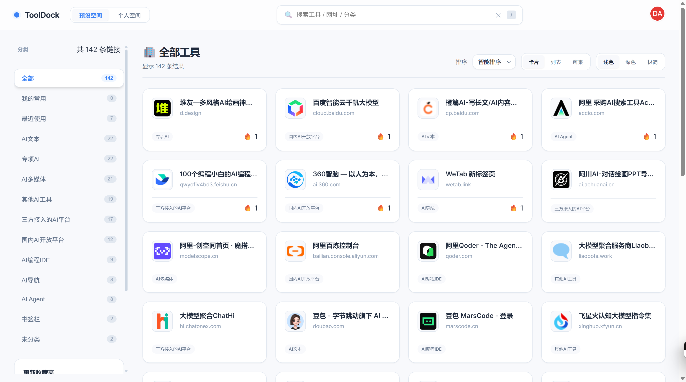
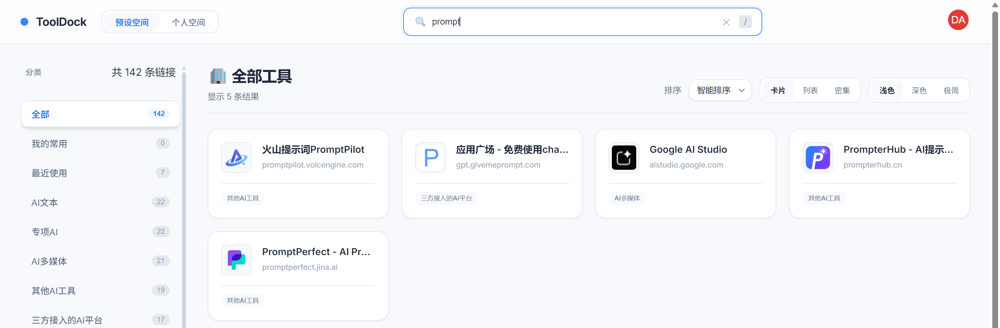
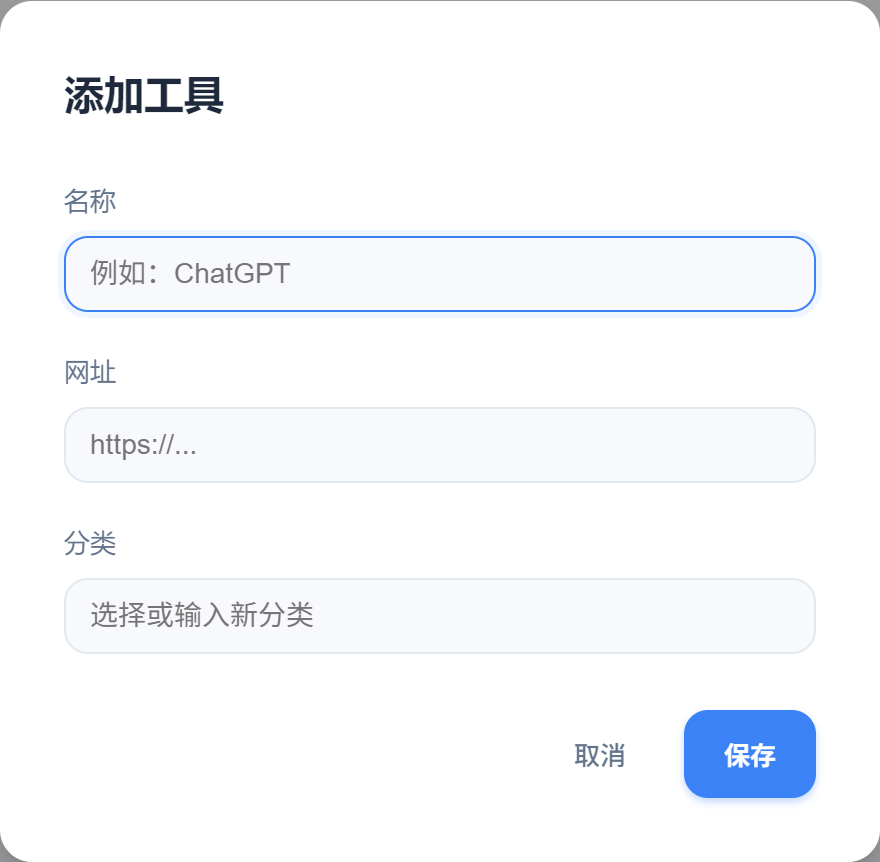
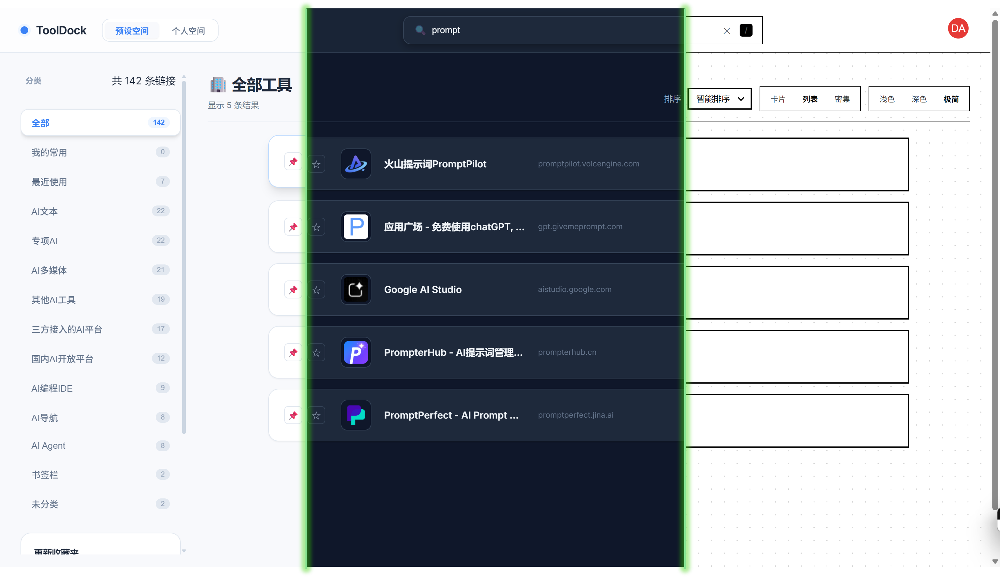
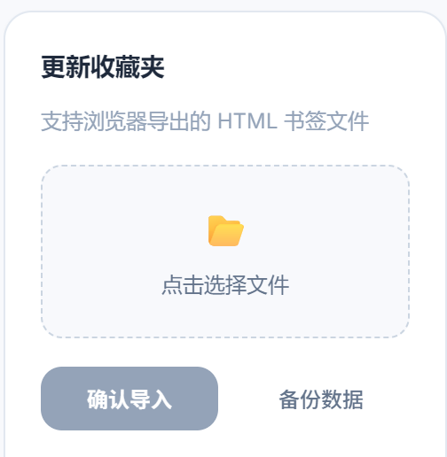

<div align="center">

# ToolDock

> 🚀 你的个人 AI 工具导航站 — 高效管理、快速访问 100+ AI 工具

[](https://opensource.org/licenses/MIT)
[](https://developer.mozilla.org/zh-CN/docs/Web/HTML)
[](https://developer.mozilla.org/zh-CN/docs/Web/JavaScript)
[](https://developer.mozilla.org/zh-CN/docs/Web/CSS)

[在线预览](https://dawsondx.github.io/tooldock/) · [功能建议](https://github.com/dawsondx/tooldock/issues) · [更新日志](#更新日志)

</div>

---

## 📖 项目简介

**ToolDock** 是一款简洁高效的 AI 工具导航与管理平台，专为开发者和 AI 爱好者设计。它帮助你集中管理各类 AI 工具，告别书签栏的混乱，让工具触手可及。

### ✨ 核心亮点

- **双模式空间** — 预设空间精选 100+ AI 工具，个人空间支持自定义收藏
- **智能搜索** — 支持按名称、网址、分类快速检索，键盘快捷键 `/` 即刻唤起
- **灵活导入** — 一键导入浏览器书签（HTML 格式），告别手动整理
- **多视图切换** — 卡片 / 列表 / 密集三种视图，满足不同浏览习惯
- **主题系统** — 浅色 / 深色 / 极简三种主题，护眼又美观
- **智能排序** — 默认 / 智能 / 名称 / 最近使用 / 常用次数五种排序方式
- **Favicon 缓存** — 自动获取并缓存网站图标，IndexedDB 本地存储
- **云端同步** — 登录账户，数据自动同步，多设备无缝切换

---

## 🎯 功能特性

| 功能模块 | 描述 |
| :--- | :--- |
| **🗂️ 分类导航** | AI 导航、国内 AI 平台、AI 文本、AI 多媒体、专项 AI、AI 编程 IDE、AI Agent 等 |
| **🔍 全局搜索** | 实时搜索工具名称、网址和分类，支持 `/` 快捷键唤起 |
| **📥 书签导入** | 支持浏览器导出的 HTML 书签文件一键导入 |
| **💾 数据备份** | 本地数据导出备份，随时恢复 |
| **➕ 工具管理** | 手动添加、编辑、删除工具，自定义分类 |
| **🎨 视图切换** | 卡片视图、列表视图、密集视图三种展示模式 |
| **🌙 主题切换** | 浅色、深色、极简三种主题，跟随系统或手动切换 |
| **📊 智能排序** | 默认排序、智能排序、名称 A-Z、最近使用、常用次数 |
| **👤 用户系统** | 邮箱注册登录、Google 一键登录、密码重置 |
| **☁️ 数据同步** | 登录后数据云端同步，多设备一致体验 |
| **🖼️ 图标管理** | 自动获取网站 Favicon，多源获取、本地缓存、智能重试 |

---

## 🎬 效果预览

<!-- 添加截图说明 -->
> 📸 **截图指南**：将项目运行截图放入 `screenshots/` 目录，命名为 `preview.png`，然后更新下方图片路径

<div align="center">
  
</div>

<!-- 建议添加更多展示不同功能的截图 -->
<!--
### 功能截图

| 主界面 | 搜索功能 | 添加工具 |
|--------|----------|----------|
|  |  |  |

| 主题切换 | 视图切换 | 书签导入 |
|--------|----------|----------|
|  |  |  |
-->

---

## 🚀 快速开始

### 在线使用

直接访问 [GitHub Pages](https://dawsondx.github.io/tooldock/) 即可使用，无需安装。

### 本地部署

#### 方式一：直接打开

```bash
# 克隆仓库
git clone https://github.com/dawsondx/tooldock.git

# 进入目录
cd tooldock

# 用浏览器打开 index.html
```

#### 方式二：本地服务器

```bash
# 使用 Python 启动本地服务器
python -m http.server 8000

# 或使用 Node.js
npx serve .

# 访问 http://localhost:8000
```

#### 方式三：Vercel / Netlify 部署

1. Fork 本仓库
2. 在 [Vercel](https://vercel.com) 或 [Netlify](https://netlify.com) 导入项目
3. 自动构建完成，获得访问链接

---

## 🛠️ 技术栈

```
前端框架：原生 JavaScript (Vanilla JS)
样式方案：CSS3 + CSS Variables
数据存储：IndexedDB (Favicon 缓存) + LocalStorage (用户数据)
图标获取：Favicon.im + Favicon Grabber API
字体：Inter (Google Fonts)
```

---

## 📁 项目结构

```
tooldock/
├── index.html              # 主页面
├── bookmarks-data.js       # 书签数据（自动生成）
├── favicon-manager.js      # Favicon 管理器
├── assets/
│   ├── index-DROU6LMg.js   # 打包后的主逻辑
│   ├── index-DROU6LMg.js.map
│   └── index-CgyEKKiD.css  # 打包后的样式
└── README.md               # 项目说明
```

---

## 📖 使用指南

### 导入浏览器书签

1. **导出浏览器书签**
   - Chrome: 设置 → 书签 → 书签管理器 → 导出书签
   - Edge: 设置 → 个人资料 → 导出收藏夹
   - Firefox: 书签管理器 → 导出

2. **在 ToolDock 中导入**
   - 点击左侧「更新收藏夹」区域
   - 选择导出的 HTML 文件
   - 点击「确认导入」

### 添加自定义工具

点击右上角「+ 添加」按钮，填写：
- **名称**：工具名称
- **网址**：完整的 URL（如 `https://chat.openai.com`）
- **分类**：选择现有分类或输入新分类

### 快捷键

| 快捷键 | 功能 |
| :--- | :--- |
| `/` | 聚焦搜索框 |
| `Esc` | 清空搜索 / 关闭弹窗 |

---

## 🗺️ 预设分类

| 分类 | 说明 |
| :--- | :--- |
| **AI 导航** | AI 工具导航网站 |
| **国内 AI 开放平台** | 国内大模型 API 平台（火山、Moonshot、阿里百炼等） |
| **AI 文本** | 文本类 AI 工具（ChatGPT、Gemini、Kimi、豆包等） |
| **AI 多媒体** | 图片、视频、音频 AI 工具（即梦、海螺、Suno 等） |
| **专项 AI** | 垂直领域 AI 工具（法律、思维导图、PPT 等） |
| **三方接入 AI 平台** | 聚合多个 AI 模型的平台 |
| **其他 AI 工具** | Prompt 优化、检测、工具集等 |
| **AI 编程 IDE** | AI 辅助编程工具（Trae、Qoder、MarsCode 等） |
| **AI Agent** | AI 智能体平台（扣子、Dify 等） |

---

## 🔧 开发计划

- [ ] 支持书签文件夹结构导入
- [ ] 添加工具使用频率统计
- [ ] 支持标签系统
- [ ] 添加键盘快捷键自定义
- [ ] 支持导出为 JSON/CSV
- [ ] 添加工具评分和评论
- [ ] 支持深色模式自动跟随系统
- [ ] 添加 PWA 支持

---

## 🤝 贡献指南

欢迎提交 Issue 和 Pull Request！

1. Fork 本仓库
2. 创建特性分支 (`git checkout -b feature/AmazingFeature`)
3. 提交更改 (`git commit -m 'Add some AmazingFeature'`)
4. 推送到分支 (`git push origin feature/AmazingFeature`)
5. 提交 Pull Request

---

## 📄 许可证

本项目采用 [MIT](LICENSE) 许可证。

---

## 🌟 致谢

- [Favicon.im](https://favicon.im) — 网站图标 API
- [Favicon Grabber](https://favicongrabber.com) — 备用图标 API
- [Inter Font](https://fonts.google.com/specimen/Inter) — 字体支持

---

<div align="center">

**如果这个项目对你有帮助，请给一个 ⭐️ Star！**

Made with ❤️ by [dawsondx](https://github.com/dawsondx)

</div>
